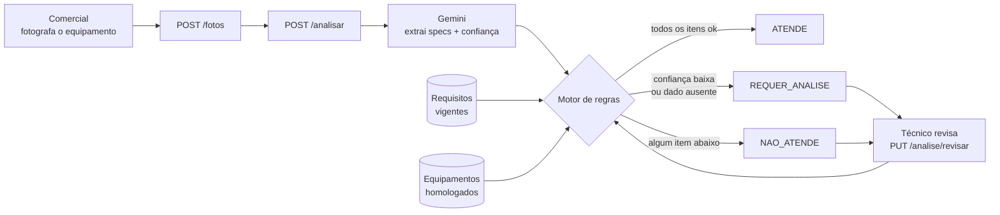
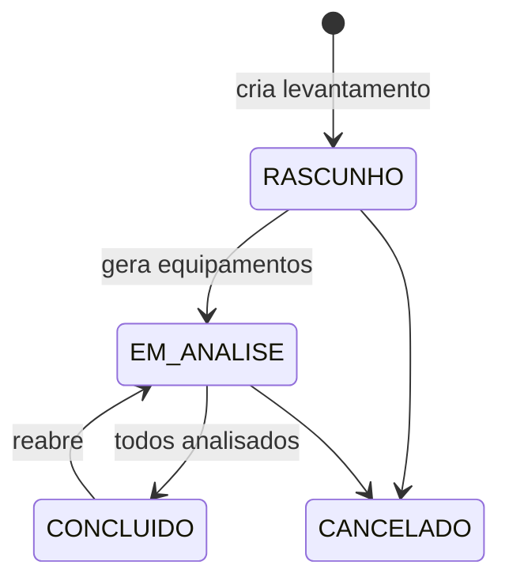

<div align="center">

# Validador de Infraestrutura

**Tire uma foto da etiqueta do equipamento. A IA lê as especificações, um motor de regras decide se atende.**

API para levantamento de infraestrutura de clientes: cadastro de clientes, levantamentos, upload de fotos dos equipamentos, extração de especificações por visão computacional (Gemini) e validação automática contra requisitos técnicos e uma base de equipamentos homologados, com revisão humana no fim.


</div>

---

## O problema

Antes de implantar um sistema num cliente, alguém precisa ir até a loja e conferir se cada servidor, PDV e máquina de retaguarda tem processador, memória, disco e sistema operacional suficientes. Hoje isso é feito na mão: anota-se o modelo, procura-se a ficha técnica, compara-se com uma planilha de requisitos.

Este projeto automatiza esse trabalho. O comercial fotografa a etiqueta ou a tela de propriedades do sistema pelo celular. A IA extrai as especificações e o motor de regras compara com os requisitos vigentes daquela função. Quando a IA não tem certeza, o técnico revisa e corrige o que ela leu errado.

## Destaques

- **Extração por IA com nível de confiança**: o Gemini devolve cada campo (fabricante, CPU, geração, cores, RAM, discos, SO) junto com uma confiança de 0 a 1. Campos abaixo de **0.7** não são aceitos às cegas: viram `REQUER_ANALISE`.
- **Motor de regras determinístico**: a IA só lê; quem decide é código testável. Os requisitos são versionados por categoria e função (ex.: *servidor de banco de dados* ≠ *servidor de aplicação*) e cada item avaliado sai com valor encontrado, requisito e justificativa.
- **Base de homologados**: o modelo lido é cruzado com a lista de equipamentos homologados, normalizando sufixos como `SFF`, `Tower`, `Gen10` e `G9`.
- **Humano no circuito**: o técnico revisa a análise. Os campos corrigidos entram com confiança 1.0, o motor reavalia e a leitura original da IA fica guardada para auditoria.
- **Ciclo de vida do levantamento**: `RASCUNHO → EM_ANALISE → CONCLUIDO` (com reabertura) ou `CANCELADO`. Só conclui com todos os equipamentos analisados, e nenhuma chamada paga à IA acontece num levantamento bloqueado.
- **Segurança de verdade**: JWT com access token (15 min) e refresh token (7 dias) revogável no logout, além de três perfis (`ADMIN`, `COMERCIAL`, `TECNICO`) com permissões por rota.
- **Cadastro com BrasilAPI**: consulta o CNPJ na Receita para autocompletar o cliente, já aceitando o **CNPJ alfanumérico**.
- **Sem conexão presa durante a IA**: a análise roda em três etapas (leitura → IA sem transação → escrita), para não segurar conexão do pool enquanto o modelo pensa.

## Como funciona



E o ciclo do levantamento:



## Stack

| Camada | Tecnologia |
|---|---|
| Linguagem / framework | Java 17, Spring Boot 4.1 (Web MVC, Data JPA, Validation, Security, Actuator) |
| IA | Spring AI 2.0 com Gemini Flash, pela API compatível com OpenAI do Google AI Studio |
| Banco | PostgreSQL 14 |
| Autenticação | JWT (jjwt 0.13), access + refresh token |
| Documentação | springdoc-openapi (Swagger UI) |
| Integrações | BrasilAPI (consulta de CNPJ) |
| Testes | JUnit 5, Mockito, MockMvc, Testcontainers |
| Infra | Docker multi-stage (JRE Alpine, usuário não-root), Docker Compose, healthcheck |

O frontend (React 19 + TanStack Query) fica num repositório separado.

## Estrutura

```
src/main/java/.../validator_infra
├── controller/      # REST + GlobalExceptionHandler (erros padronizados em JSON)
├── service/
│   ├── AnaliseService.java       # upload, análise em 3 etapas, revisão
│   ├── MotorRegrasService.java   # requisitos + homologação → resultado
│   ├── vision/                   # VisionProvider (interface) + parser da resposta da IA
│   └── brasilapi/                # consulta de CNPJ
├── entity/          # Cliente, Levantamento, Equipamento, Foto, Analise, Requisito...
├── security/        # filtro JWT, blacklist de refresh token
└── config/          # Security, OpenAPI, seed de dados
```

A IA fica atrás da interface `VisionProvider`. Trocar de provedor (já passou por OpenRouter antes do Gemini) não mexe no motor de regras nem nos testes.

## Principais endpoints

| Método | Rota | Perfis | O que faz |
|---|---|---|---|
| `POST` | `/api/auth/login` · `/refresh` · `/logout` | público | Autenticação JWT |
| `GET` | `/api/clientes/consulta-cnpj/{cnpj}` | todos | Autocompleta pela Receita (BrasilAPI) |
| `POST` | `/api/clientes` | COMERCIAL, ADMIN | Cadastra cliente |
| `POST` | `/api/levantamentos` | COMERCIAL, ADMIN | Cria levantamento em rascunho |
| `POST` | `/api/levantamentos/{id}/gerar-equipamentos` | COMERCIAL, ADMIN | Gera os equipamentos pelo dimensionamento |
| `POST` | `/api/equipamentos/{id}/fotos` | COMERCIAL, ADMIN | Upload da foto (JPEG, PNG, WebP, até 20MB) |
| `POST` | `/api/equipamentos/{id}/analisar` | COMERCIAL, ADMIN | IA + motor de regras |
| `GET` | `/api/equipamentos/{id}/analise` | todos | Análise persistida (204 se ainda não houver) |
| `PUT` | `/api/equipamentos/{id}/analise/revisar` | TECNICO, ADMIN | Corrige campos e reavalia |
| `POST` | `/api/levantamentos/{id}/concluir` · `/reabrir` · `/cancelar` | conforme a ação | Ciclo de vida |
| `GET` | `/api/levantamentos/{id}/relatorio` | todos | Relatório consolidado do levantamento |

A lista completa, com exemplos, fica no Swagger: `http://localhost:8080/swagger-ui.html`.

<details>
<summary><b>Exemplo de resposta de <code>GET /api/equipamentos/{id}/analise</code></b></summary>

```json
{
  "resultado": "ATENDE",
  "justificativa": "Todos os requisitos foram atendidos.",
  "itens": [
    { "campo": "homologacao", "valorEncontrado": "Dell PowerEdge T140", "requisito": "HOMOLOGADO", "status": "ATENDE", "observacao": "..." },
    { "campo": "ram_gb", "valorEncontrado": "32", "requisito": ">= 16", "status": "ATENDE", "observacao": "..." }
  ],
  "fabricante": "Dell",
  "modelo": "PowerEdge T140",
  "cpuFabricante": "Intel",
  "cpuModelo": "Xeon E-2224",
  "cpuGeracao": 10,
  "cpuCores": 8,
  "cpuThreads": 16,
  "ramGb": 32,
  "armazenamentoTipo": "SSD",
  "armazenamentoGb": 960,
  "soNome": "Windows Server 2022",
  "soVersao": "Standard",
  "confiancaGlobal": 0.95,
  "analisadoEm": "2026-10-09T14:32:10",
  "analisadoPorNome": "Administrador",
  "revisada": false
}
```

*Resposta resumida: o texto de `observacao` e a lista de itens dependem dos requisitos cadastrados.*

</details>

## Rodando o projeto

### Pré-requisitos

- **Docker** (com Docker Compose): para o ambiente completo e para os testes de integração
- **Java 17**: o wrapper `./mvnw` já vem incluso
- **Chave da API do Gemini**: gratuita no [Google AI Studio](https://aistudio.google.com/apikey)

### 1. Variáveis de ambiente

Copie `.env.example` para `.env` e preencha:

| Variável | Uso |
|---|---|
| `GEMINI_API_KEY` | Chave da API do Gemini (Google AI Studio), usada na extração de dados das fotos |
| `DB_PASSWORD` | Senha do PostgreSQL. No Compose, também define a senha do container do banco |
| `JWT_SECRET` | Segredo de assinatura dos JWT, com no mínimo 32 caracteres. Gere com `openssl rand -hex 32` |
| `DB_HOST`, `DB_PORT` | Só para rodar sem Docker. Padrão `localhost:5432`. O Compose ignora esses valores para a aplicação |
| `FOTOS_PATH` | Opcional. Pasta das fotos. Padrão `./storage/fotos` (no Docker, `/app/storage/fotos`, num volume) |

O `.env` não deve ser versionado. O Compose o lê automaticamente, e a aplicação também o carrega ao rodar fora do Docker.

### 2. Subindo com Docker Compose

```bash
docker compose up -d                  # Postgres 14 + API (o primeiro build leva alguns minutos)
docker compose --profile dev up -d    # idem, com Adminer para inspecionar o banco
docker compose up -d --build          # recompila a imagem depois de mudar o código
docker compose logs -f app            # logs da aplicação
docker compose down                   # para, mantendo banco e fotos
docker compose down -v                # para e APAGA os volumes (banco e fotos)
```

| Serviço | Endereço |
|---|---|
| API | http://localhost:8080 |
| Swagger UI | http://localhost:8080/swagger-ui.html |
| Health | http://localhost:8080/actuator/health |
| Adminer (profile `dev`) | http://localhost:8081: sistema PostgreSQL, servidor `postgres`, usuário `postgres`, banco `validator_infra` |
| Postgres (para a IDE) | `localhost:5433` |

As portas podem ser trocadas no `.env` com `APP_PORT`, `ADMINER_PORT` e `COMPOSE_DB_PORT`. A aplicação roda com usuário não-root, e o container fica `healthy` quando o `/actuator/health` responde `UP`.

### Sem Docker

Com um PostgreSQL 14 local e o banco `validator_infra` criado:

```bash
./mvnw spring-boot:run
```

### 3. Primeiro acesso

Na primeira subida é criado o usuário `admin` / `admin` (perfil ADMIN). **Troque essa senha antes de qualquer uso fora do ambiente de desenvolvimento.**

```bash
curl -s -X POST localhost:8080/api/auth/login \
  -H 'Content-Type: application/json' -d '{"login":"admin","senha":"admin"}'
```

Use o `token` retornado no header `Authorization: Bearer <token>`. Só `/api/auth/**`, o Swagger e o `/actuator/health` são públicos.

## Deploy em produção

Três containers na mesma rede Docker, no servidor da rede local da VR:

| Container | Imagem | Porta no servidor |
|---|---|---|
| `frontend` | `brunoliraarcia/validator-frontend` (nginx + PWA) | **80** |
| `backend` | `brunoliraarcia/validator-backend` | nenhuma (só rede interna) |
| `postgres` | `postgres:14-alpine` | nenhuma (só rede interna) |

O nginx do frontend serve o PWA e encaminha `/api/*` para `backend:8080`, então tudo sai pela porta 80 na mesma origem (sem CORS). Swagger, Actuator e os endpoints de debug `/api/vision` e `/api/motor` **não** ficam acessíveis por ela.

As imagens ficam em repositórios **privados** no Docker Hub. Backend e frontend usam **sempre a mesma tag**: se só um dos dois mudou, os dois são buildados e publicados de novo com a tag nova.

### 1. Buildar e publicar (na máquina de desenvolvimento)

Supondo os dois repositórios lado a lado (`validator-infra` e `validator-frontend`):

```bash
TAG=1.0.0

docker login -u brunoliraarcia

docker build -t brunoliraarcia/validator-backend:$TAG  .
docker build -t brunoliraarcia/validator-frontend:$TAG ../validator-frontend

docker push brunoliraarcia/validator-backend:$TAG
docker push brunoliraarcia/validator-frontend:$TAG
```

> Se o servidor for ARM e a máquina de build x86 (ou o contrário), adicione `--platform linux/amd64` (ou `linux/arm64`) ao `docker build`.

### 2. Primeira subida no servidor

O servidor precisa só do Docker e de dois arquivos deste repositório: `docker-compose.prod.yml` e o `prod.env`.

```bash
# No Docker Hub, crie um Access Token só de leitura (Account Settings → Personal access tokens)
# e use-o como senha: o servidor não precisa da senha da conta
docker login -u brunoliraarcia

cp prod.env.example prod.env     # preencha DB_PASSWORD, GEMINI_API_KEY, JWT_SECRET e TAG
docker compose -f docker-compose.prod.yml --env-file prod.env pull
docker compose -f docker-compose.prod.yml --env-file prod.env up -d
docker compose -f docker-compose.prod.yml --env-file prod.env ps    # os 3 devem ficar "healthy"
```

O sistema fica em `http://<ip-do-servidor>/`. **Troque a senha do `admin` logo no primeiro acesso.**

O `prod.env` tem segredos: não versione (o `.gitignore` já o ignora) e deixe-o legível só pelo usuário que roda o Docker (`chmod 600 prod.env`).

### 3. Atualizar para uma versão nova

Depois de publicar a nova tag (passo 1), no servidor:

```bash
# Edite TAG no prod.env (ex.: TAG=1.1.0)
docker compose -f docker-compose.prod.yml --env-file prod.env pull
docker compose -f docker-compose.prod.yml --env-file prod.env up -d
docker image prune -f            # remove as imagens antigas
```

**Rollback**: volte o `TAG` para a versão anterior e rode `up -d` de novo. Banco e fotos ficam nos volumes e não são afetados.

Logs: `docker compose -f docker-compose.prod.yml --env-file prod.env logs -f backend`.

### Pendências

- [ ] **TODO: backup.** Por enquanto é manual. Todos os dados ficam em dois volumes, `validator-prod_postgres-data` e `validator-prod_fotos`, e um backup só vale com os dois juntos:
  ```bash
  docker compose -f docker-compose.prod.yml --env-file prod.env exec -T postgres \
    pg_dump -U postgres -Fc validator_infra > backup-$(date +%F).dump
  docker run --rm -v validator-prod_fotos:/fotos:ro -v "$PWD":/backup alpine \
    tar czf /backup/fotos-$(date +%F).tar.gz -C /fotos .
  ```
  Guarde os arquivos fora do servidor. **Nunca** rode `down -v` em produção: apaga os dois volumes.
- [ ] **TODO: HTTPS** (próximo passo, quando o sistema for exposto fora da rede local). Plano: Let's Encrypt com Caddy ou Nginx Proxy Manager na frente do container `frontend`. Enquanto for HTTP, o app funciona no navegador, mas não instala como PWA (service worker exige HTTPS fora de `localhost`).
- [ ] **TODO: Flyway** (próxima fase). Hoje o schema é atualizado por `spring.jpa.hibernate.ddl-auto=update`, um risco aceito no MVP. Faça backup antes de subir uma versão que mude entidades.

## Testes

```bash
./mvnw test
```

**109 testes**, divididos em:

- **Unitários**: motor de regras (operadores, confiança baixa, múltiplos discos, homologação, erro da IA), regras de status do levantamento e parser da resposta da IA. Mockito puro, sem banco.
- **Integração** (`@IntegrationTest`): sobem a aplicação inteira contra um **PostgreSQL 14 real e descartável via Testcontainers**, a mesma versão do Compose. Cobrem autenticação e permissões por perfil, o ciclo completo do levantamento, upload e download de fotos e a consulta da análise.
  - **Exigem Docker rodando.** Sem Docker, falham com erro explícito; não são ignorados.
  - A IA é sempre mockada: nenhum teste consome quota paga, e há testes que provam que ela **não** é chamada quando o levantamento está bloqueado.
  - Não usam o banco local nem o `.env`: a configuração de teste está em `src/test/resources/application-test.properties`.

---

<div align="center">

Feito por **[Bruno Lira](https://github.com/Brunolira123)**

</div>
